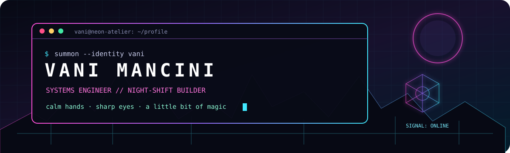
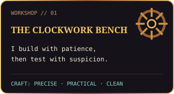
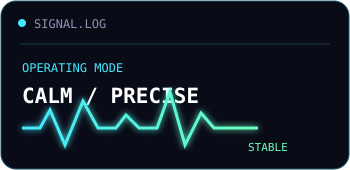
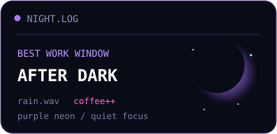

<div align="center">



`TAIPEI // NIGHT SHIFT // CHANNEL 0512`


</div>

## `> whoami`

```toml
[name]
first = "Vani"
last  = "Mancini"
home  = "Taiwan"

[work]
class   = "systems engineer"
range   = ["frontend", "backend", "cloud", "automation"]
method  = "understand → build → run → prove"

[personality]
traits  = ["calm", "bold", "careful", "curious"]
fuel    = ["coffee", "rainy nights", "a good mystery"]
```

Hi, I’m Vani. I build software, untangle strange failures, and keep systems alive after launch.  
I like clean boundaries, observable behavior, and solutions that are clever **without becoming fragile**.

When the city goes quiet and the terminal starts glowing, that’s usually when I do my best work. 🌙

## `> open grimoire/toolchain.cast`

<div align="center">


</div>

## `> run vani --interactive`

```console
visitor@neon-city:~$ vani status
✓ present
✓ caffeinated
✓ listening

visitor@neon-city:~$ vani solve --input "something weird is happening"
[01] trace the signal
[02] find the real fault
[03] build the smallest correct fix
[04] run the real path
[05] leave the system better than I found it

visitor@neon-city:~$ echo $VANI_MOTTO
Make it work. Make it clear. Add a little magic.
```

## `> telemetry --local --no-cloud`

<div align="center">





</div>

> These panels live inside this repository—no rate limits, no broken stats service, no distant oracle required.

## `> map the quest`

```text
╭──────────────────────────────────────────────────────────────╮
│  vague idea                                                  │
│      ╰─► architecture ─► working artifact ─► real evidence  │
│                                          ╰─► safe operation  │
╰──────────────────────────────────────────────────────────────╯
```

<details>
<summary><b>🜁 A note from the night shift</b></summary>
<br>

I’m serious about the work, not about looking serious all the time.
Good engineering can be rigorous, kind, and still have style.

If you arrive with an ambitious idea, a stubborn bug, or a system that only fails under a full moon—pull up a chair.

</details>

## `> establish_link`

<div align="center">

[](mailto:mds.lavoya@gmail.com)
[](https://github.com/vanimancini)

### `connection established // welcome to the atelier` ✦

</div>
